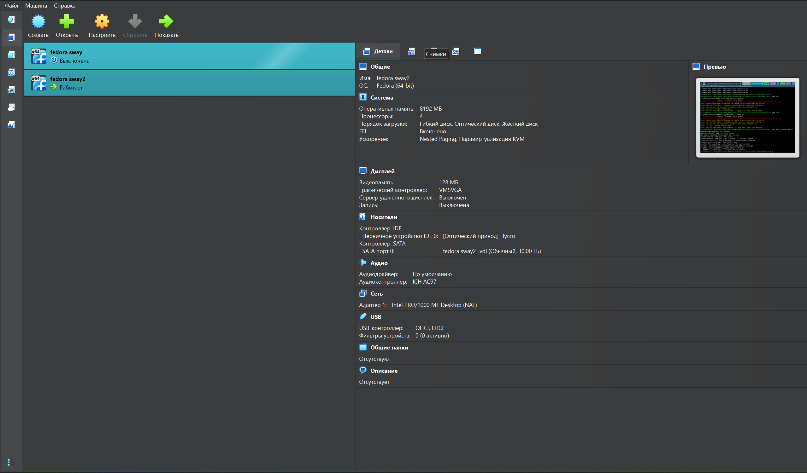
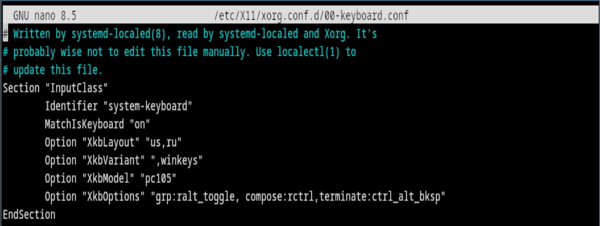
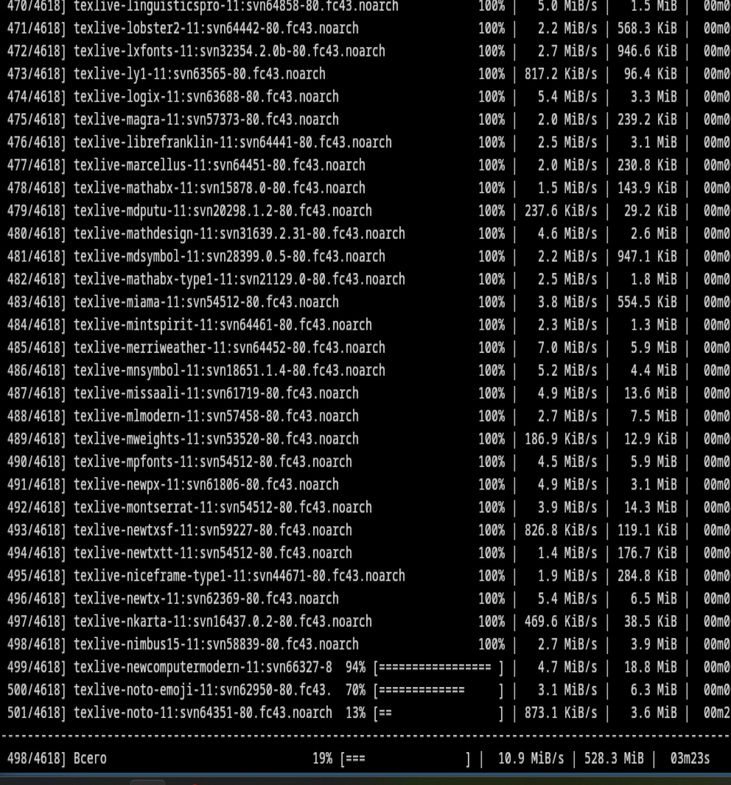
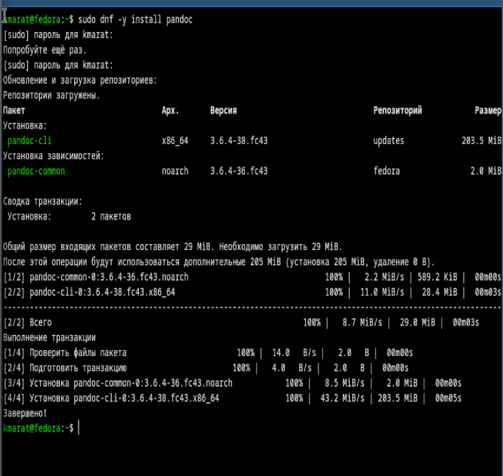
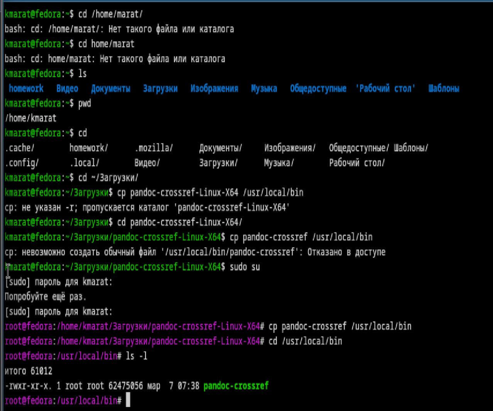
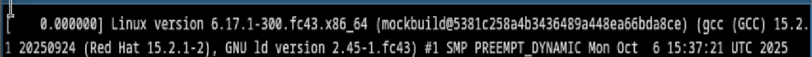
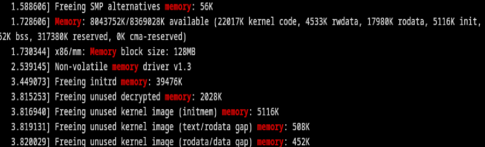
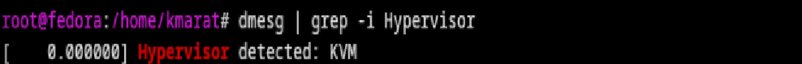
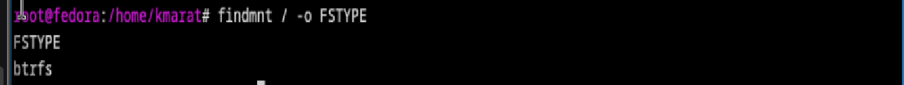
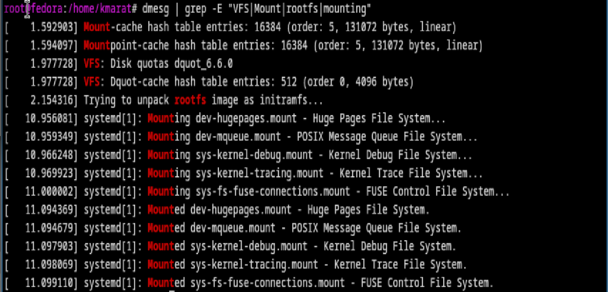

---
## Author
author:
  name: Хасанов Марат Наилович 
  degrees: DSc
  orcid: 0000-0002-0877-7063
  email: 132250428@rudn.ru
  affiliation:
    - name: Российский университет дружбы народов
      country: Российская Федерация
      postal-code: 117198
      city: Москва
      address: ул. Миклухо-Маклая, д. 6

## Title
title: "Лабораторная работа 1"

license: "CC BY"
---

# Цель работы

Целью данной работы является приобретение практических навыков установки операционной системы на виртуальную машину, настройки минимально необходимых для дальнейшей работы сервисов.

# Выполнение лабораторной работы

Я установил Fedora Sway на VirtualBox([рис. @fig-001]).

{#fig-001 width=70%}

Настроим раскладку([рис. @fig-002]).

{#fig-002 width=70%}

Установим Texlive([рис. @fig-003]).

{#fig-003 width=70%}

Установим pandoc crosreff([рис. @fig-004]).

{#fig-004 width=70%}

Установим pandoc([рис. @fig-005]).

{#fig-005 width=70%}

# Домашнее задание

Узнаем версию ядра Linux([рис. @fig-006]).

{#fig-006 width=70%}

Узнаем частоту процессора (Detected Mhz processor)([рис. @fig-007]).

{#fig-007 width=70%}

Узнаем модель процессора (CPU0).([рис. @fig-008]).

{#fig-008 width=70%}

Узнаем объём доступной оперативной памяти (Memory available).([рис. @fig-009]).

{#fig-009 width=70%}

Узнаем тип обнаруженного гипервизора (Hypervisor detected).([рис. @fig-010]).

{#fig-010 width=70%}

Узнаем тип файловой системы корневого раздела.([рис. @fig-011]).

{#fig-011 width=70%}

Узнаем последовательность монтирования файловых систем.([рис. @fig-012]).

{#fig-012 width=70%}

# Выводы

В ходе выполнения лабораторный работы приборел навыки установки виртуальной машины на Qemu, установил ряд пакетов и настроил ОС для дальнейшей работы на ней.

# Список литературы{.unnumbered}

::: {#refs}
:::
