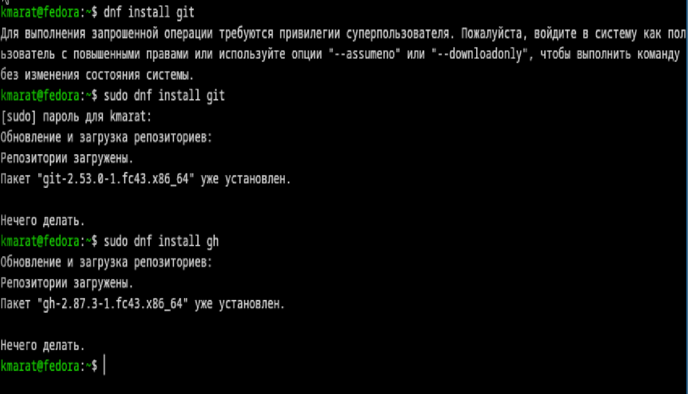
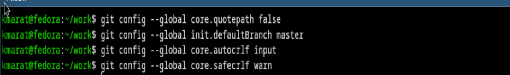
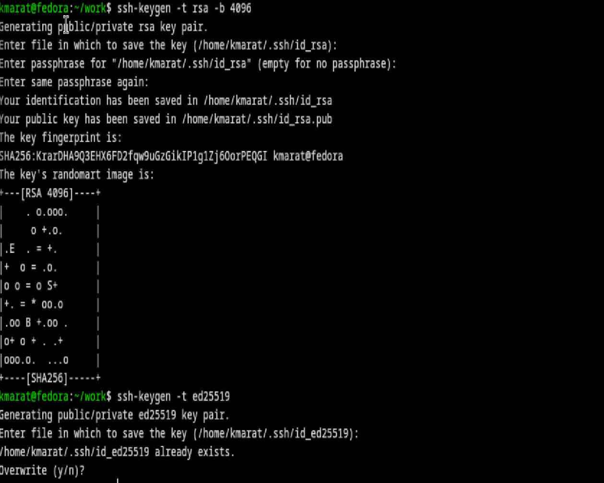
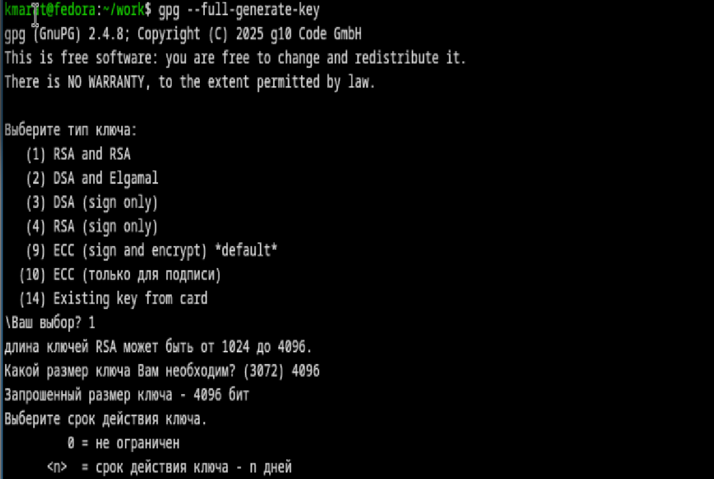
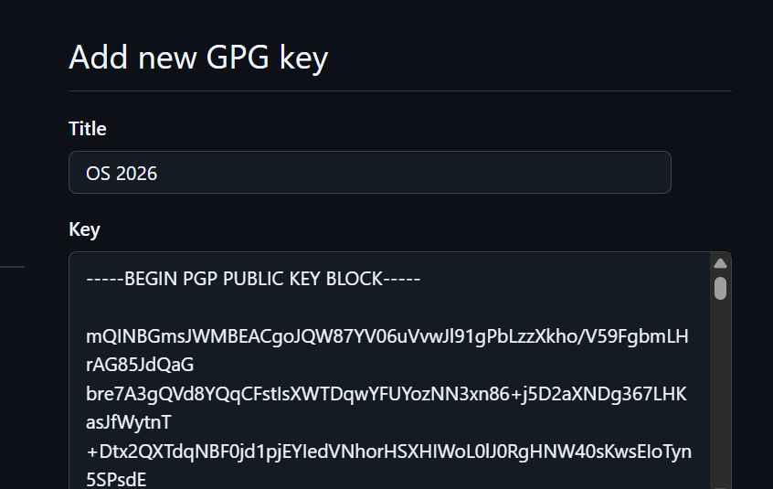
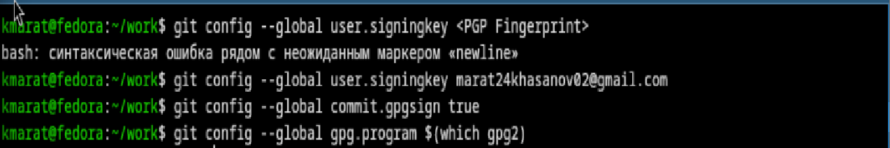
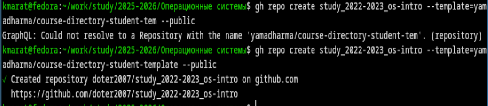
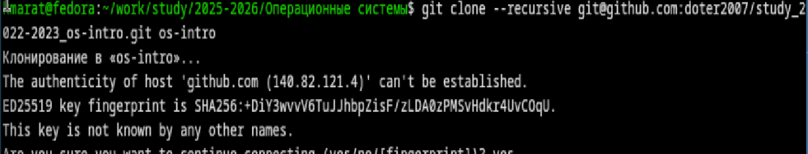
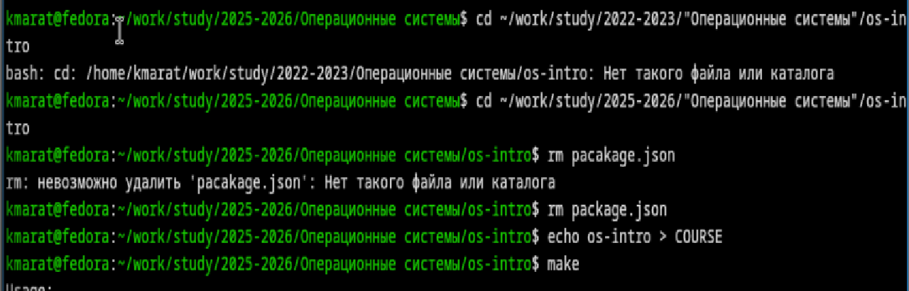

---
## Author
author:
  name: Хасанов Марат Наилович 
  degrees: DSc
  orcid: 0000-0002-0877-7063
  email: 132250428@rudn.ru
  affiliation:
    - name: Российский университет дружбы народов
      country: Российская Федерация
      postal-code: 117198
      city: Москва
      address: ул. Миклухо-Маклая, д. 6

## Title
title: "Лабораторная работа 2"

license: "CC BY"
---

# Цель работы
1. Система контроля версий Git представляет собой набор программ командной строки. Доступ к ним можно получить из терминала посредством ввода команды git с различными опциями.
2. Благодаря тому, что Git является распределённой системой контроля версий, резервную копию локального хранилища можно сделать простым копированием или архивацией.

# Задание

1. Создать базовую конфигурацию для работы с git.
2. Создать ключ SSH.
3. Создать ключ PGP.
4. Настроить подписи git.
5. Зарегистрироваться на Github.
6. Создать локальный каталог для выполнения заданий по предмету.

# Выполнение лабораторной работы

Установим  git и gh([рис. @fig-001]).

{#fig-001 width=70%}

Настроим git([рис. @fig-002]).

{#fig-002 width=70%}

Создадим ключи ssh и gpg ([рис. @fig-003]).

{#fig-003 width=70%}

Настроим github([рис. @fig-004]).

{#fig-004 width=70%}

Настроим автоматические подписи коммитов git.([рис. @fig-005]).

{#fig-005 width=70%}

Настроим gh([рис. @fig-006]).

{#fig-006 width=70%}

Создадим репозиторий курса на основе шаблона([рис. @fig-007]).

{#fig-007 width=70%}

Настроим каталог курса и удалим лишние файлы и создадим необходимые каталоги([рис. @fig-008]).

{#fig-008 width=70%}

Отправим файлы на сервер([рис. @fig-009]).

{#fig-009 width=70%}

# Выводы

В результате выполнения данной лабораторной работы я приобрел необходимые навыки работы с гит, научился созданию репозиториев, gpg и ssh ключей, настроил каталог курса и авторизовался в gh.

# Список литературы{.unnumbered}

::: {#refs}
:::
