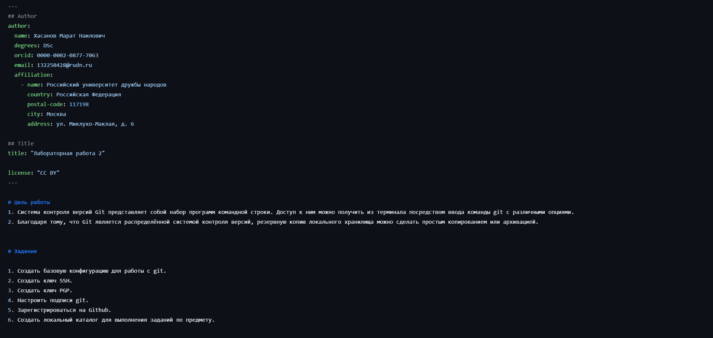
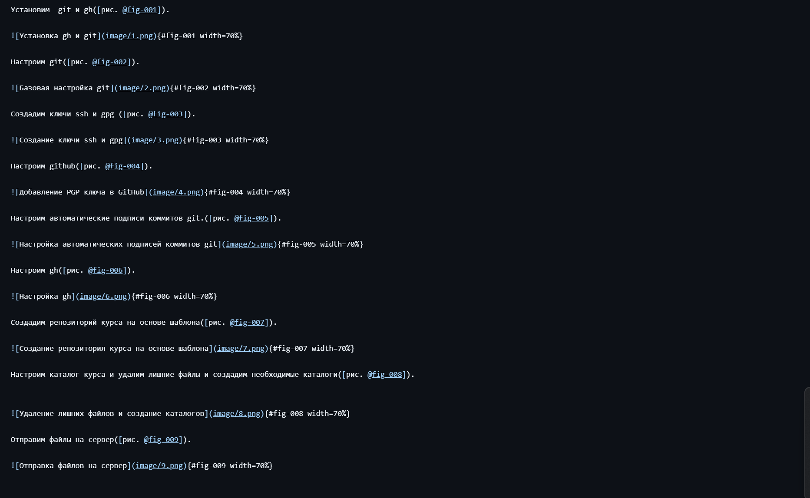

---
## Author
author:
  name: Хасанов Марат Наилович 
  degrees: DSc
  orcid: 0000-0002-0877-7063
  email: 132250428@rudn.ru
  affiliation:
    - name: Российский университет дружбы народов
      country: Российская Федерация
      postal-code: 117198
      city: Москва
      address: ул. Миклухо-Маклая, д. 6

## Title
title: "Лабораторная работа 3"

license: "CC BY"
---

# Цель работы

Научиться оформлять отчёты с помощью легковесного языка разметки Markdown.

# Выполнение лабораторной работы

По шаблону заполнил титульный лист и сформировал список раздела "Задания"([рис. @fig-001]).

{#fig-001 width=70%}

Выполнение работы заполни и прикрепил скриншоты([рис. @fig-002]).

{#fig-002 width=70%}

# Выводы

В ходе выполнения данной лабораторной работы я научился оформлять отчёты с помощью легковесного языка разметки Markdown.

# Список литературы{.unnumbered}

::: {#refs}
:::
