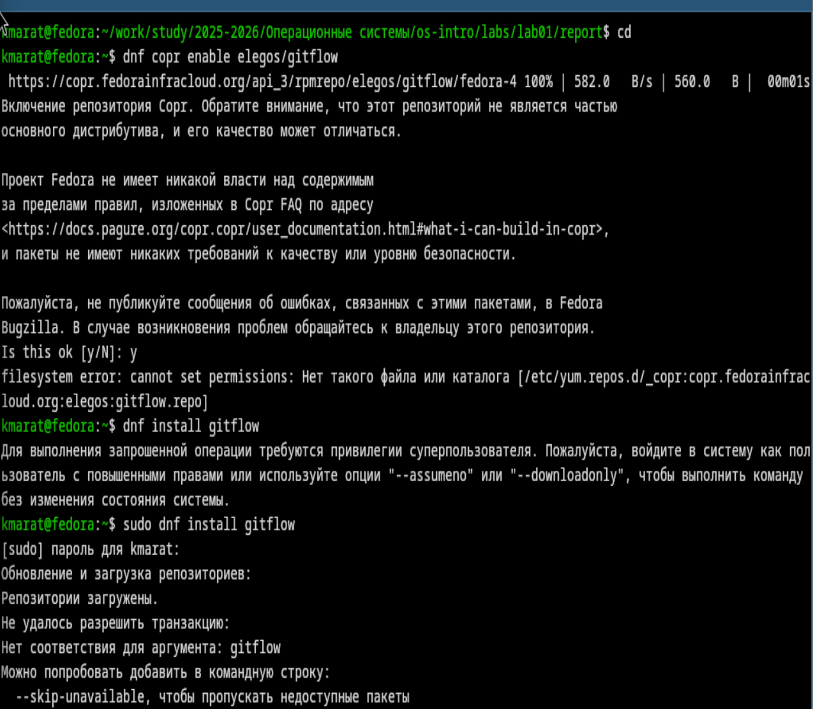
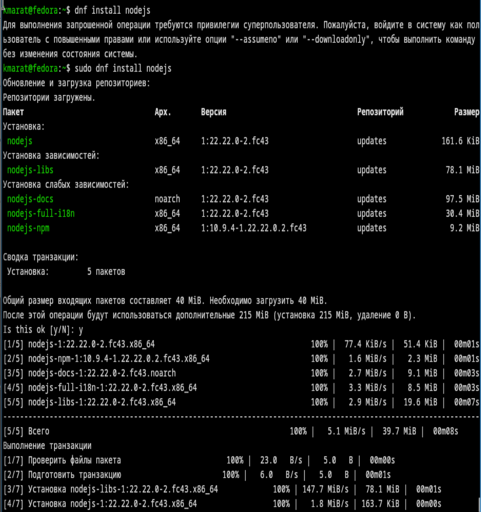
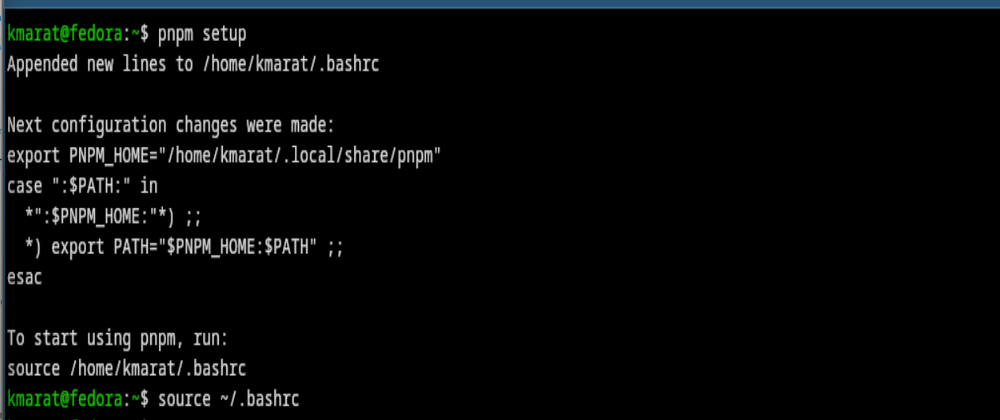
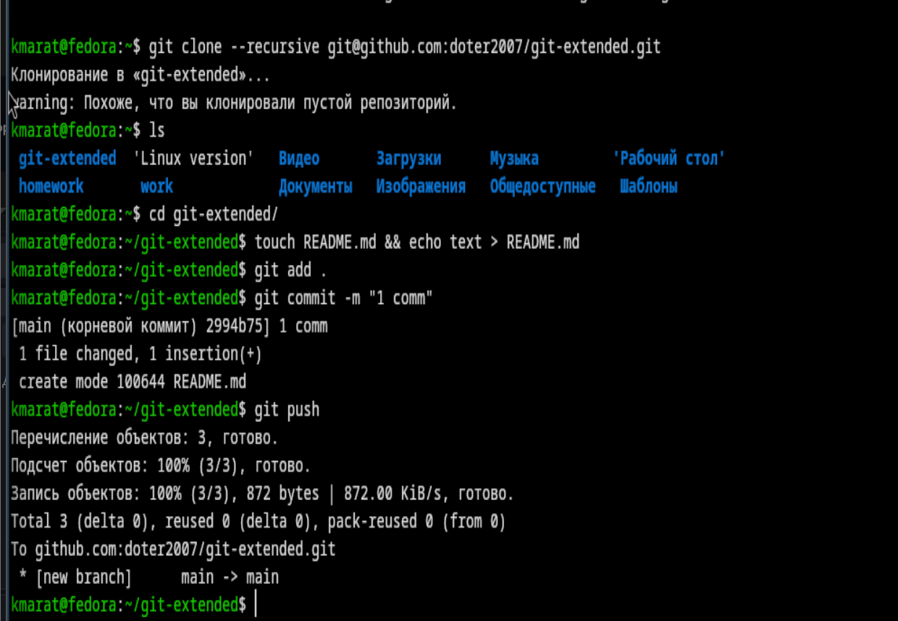
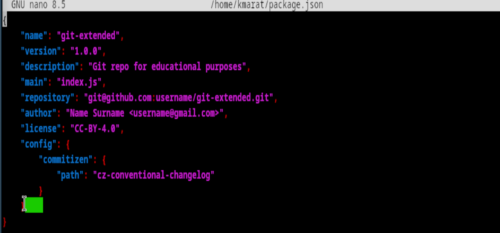
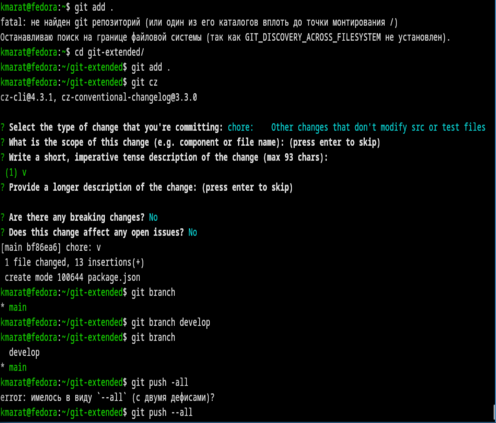
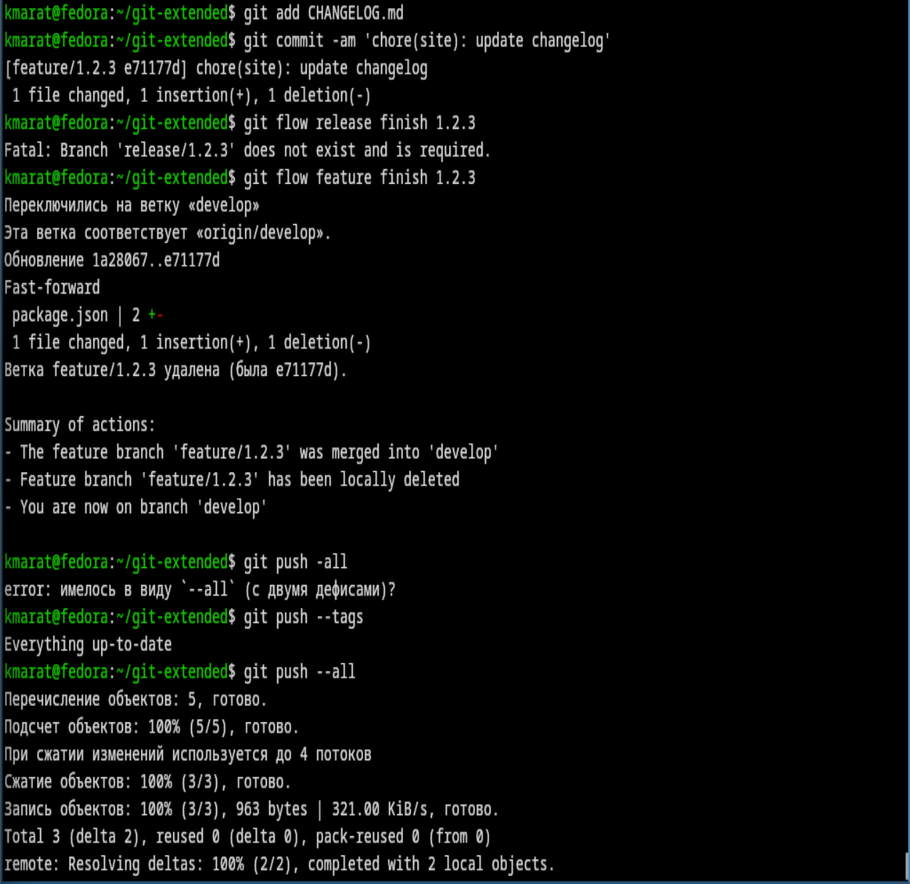

---
## Author
author:
  name: Хасанов Марат Наилович 
  degrees: DSc
  orcid: 0000-0002-0877-7063
  email: 132250428@rudn.ru
  affiliation:
    - name: Российский университет дружбы народов
      country: Российская Федерация
      postal-code: 117198
      city: Москва
      address: ул. Миклухо-Маклая, д. 6

## Title
title: "Лабораторная работа 4"

license: "CC BY"
---

# Цель работы
Получение навыков правильной работы с репозиториями git.

# Задание

1. Выполнить работу для тестового репозитория.
2. Преобразовать рабочий репозиторий в репозиторий с git-flow и conventional commits.

# Выполнение лабораторной работы

Установим  gitflow([рис. @fig-001]).

{#fig-001 width=70%}

Установим Node.js([рис. @fig-002]).

{#fig-002 width=70%}

Настроим Node.js([рис. @fig-003]).

{#fig-003 width=70%}

Создадим репозиторий git([рис. @fig-004]).

{#fig-004 width=70%}

Сконфигурим формат коммитов. Для этого добавим в файл package.json команду для формирования коммитов.([рис. @fig-005]).

{#fig-005 width=70%}

Делаю первый commit и инициализирую git flow([рис. @fig-006]).

{#fig-006 width=70%}

Создадим ветку для новой функциональности([рис. @fig-007]).

{#fig-007 width=70%}

Создаю релиз 1.2.3, делаю изменения и отправляю на сервер([рис. @fig-008]).

{#fig-008 width=70%}

# Выводы

В ходе выполнения лабораторный работы я получил навыки правильной работы с репозиториями git.

# Список литературы{.unnumbered}

::: {#refs}
:::
