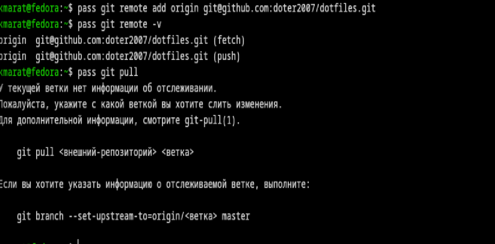
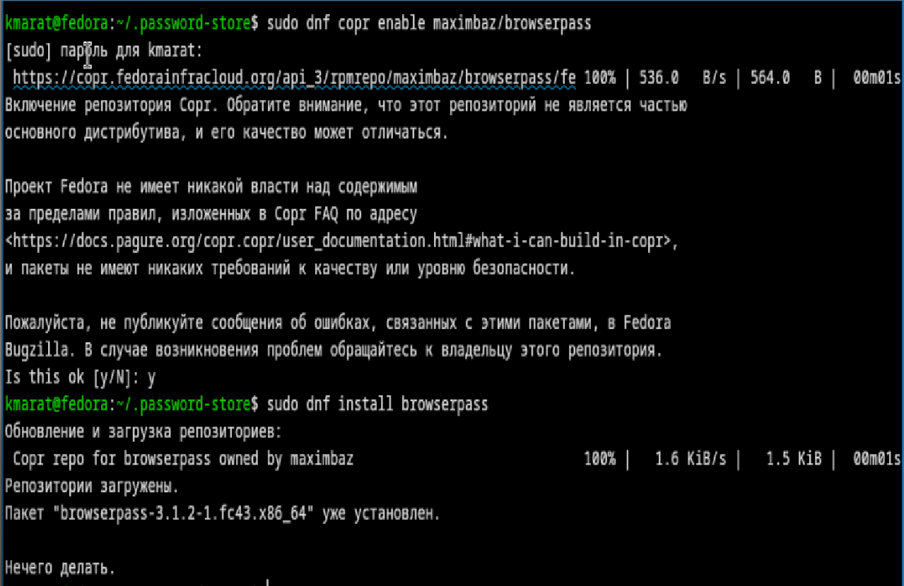
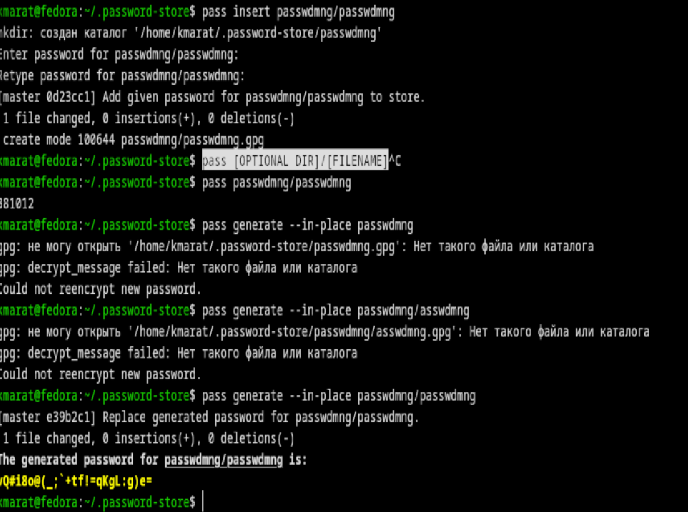
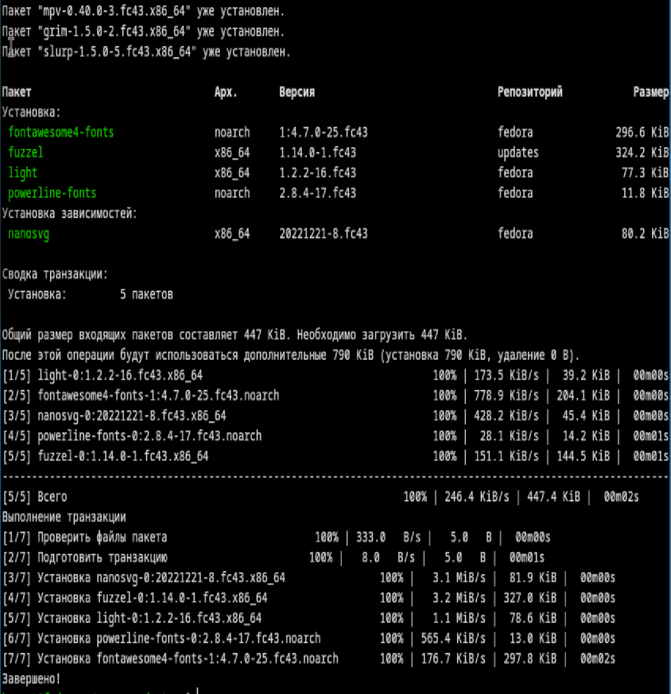
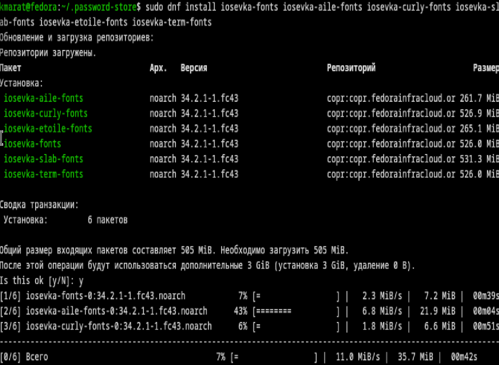
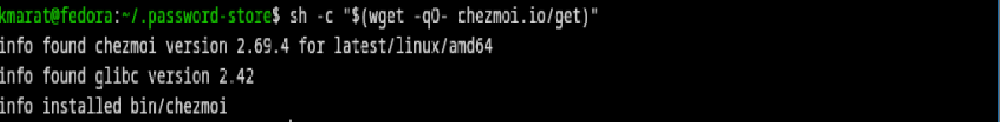

---
## Author
author:
  name: Хасанов Марат Наилович 
  degrees: DSc
  orcid: 0000-0002-0877-7063
  email: 132250428@rudn.ru
  affiliation:
    - name: Российский университет дружбы народов
      country: Российская Федерация
      postal-code: 117198
      city: Москва
      address: ул. Миклухо-Маклая, д. 6

## Title
title: "Лабораторная работа 5"

license: "CC BY"
---

# Цель работы

Познакомиться с pass, gopass, native messaging, chezmoi. Научиться пользоваться этими утилитами, синхронизировать их с гит.

# Задание

1. Установить дополнительное ПО
2. Установить и настроить pass
3. Настроить интерфейс с браузером
4. Сохранить пароль
5. Установить и настроить chezmoi
6. Настроить chezmoi на новой машине
7. Выполнить ежедневные операции с chezmoi

# Выполнение лабораторной работы

Создаю новый репозиторий, устанавливаю pass и синхронизирую c git([рис. @fig-001]).

{#fig-001 width=70%}

Установливаю интерфейс для взаимодействия с браузером([рис. @fig-002]).

{#fig-002 width=70%}

Добавляю новый пароль и тут же его заменяю([рис. @fig-003]).

{#fig-003 width=70%}

Устанавливаю дополнительное программное обеспечение([рис. @fig-004]).

{#fig-004 width=70%}

Устанавливаю шрифты([рис. @fig-005]).

{#fig-005 width=70%}

Устанавливаю chezmoi([рис. @fig-006]).

{#fig-006 width=70%}

# Выводы

Мы познакомились с pass, gopass, native messaging, chezmoi. Научились пользоваться этими утилитами, синхронизировали их с гит.

# Список литературы{.unnumbered}

::: {#refs}
:::
