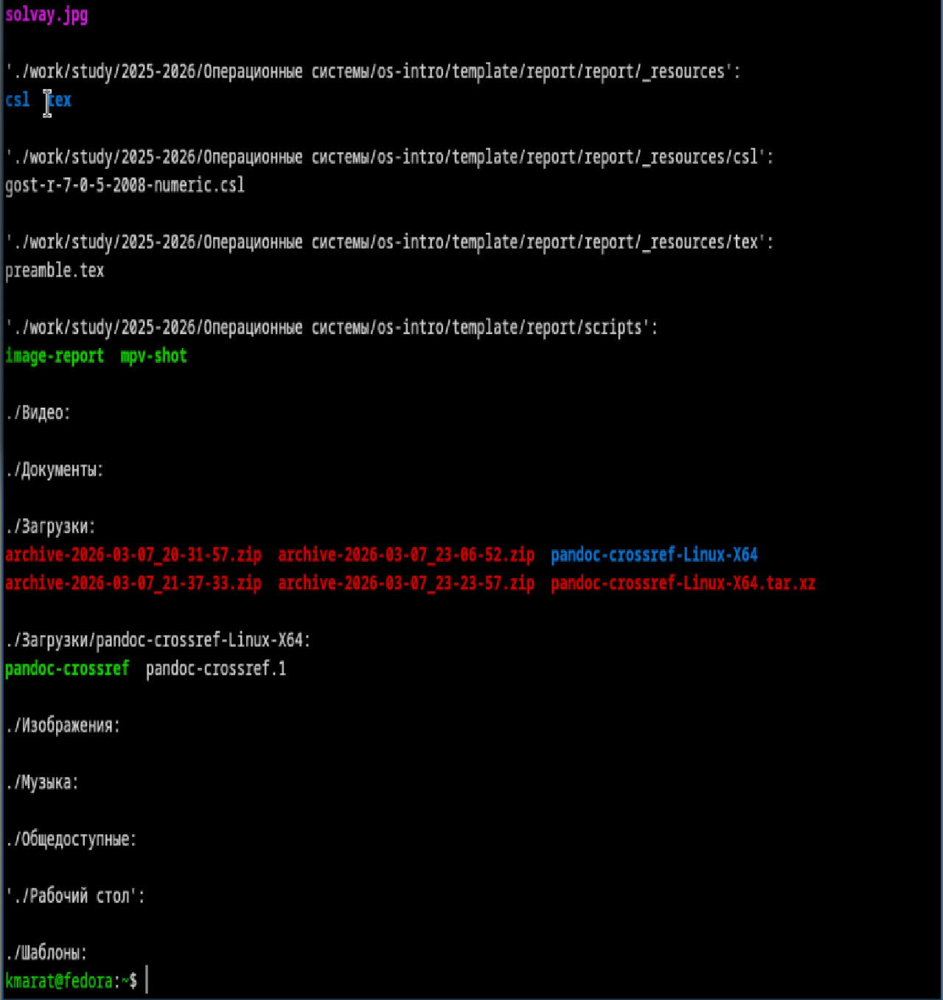
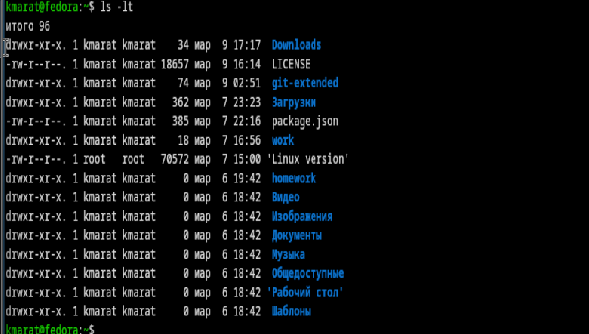
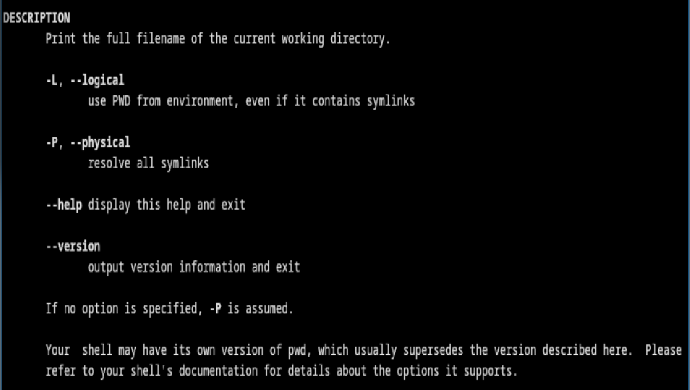
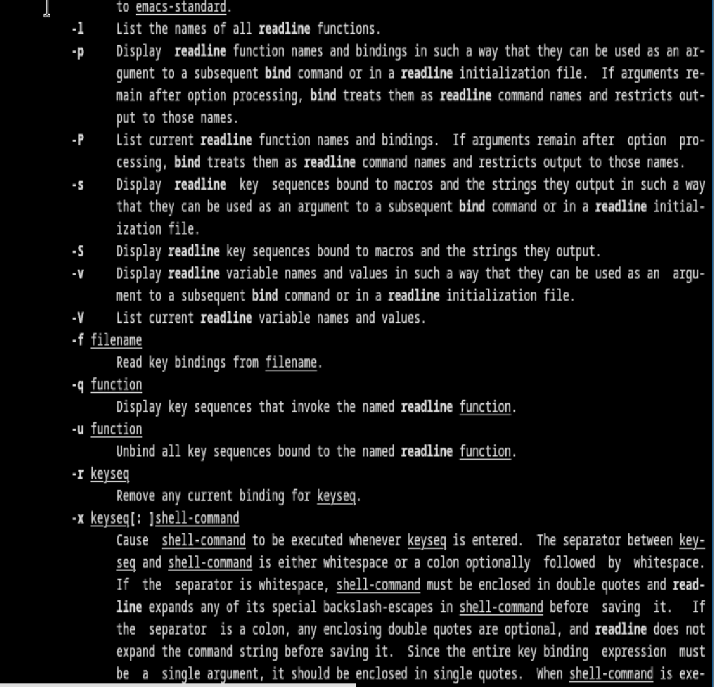
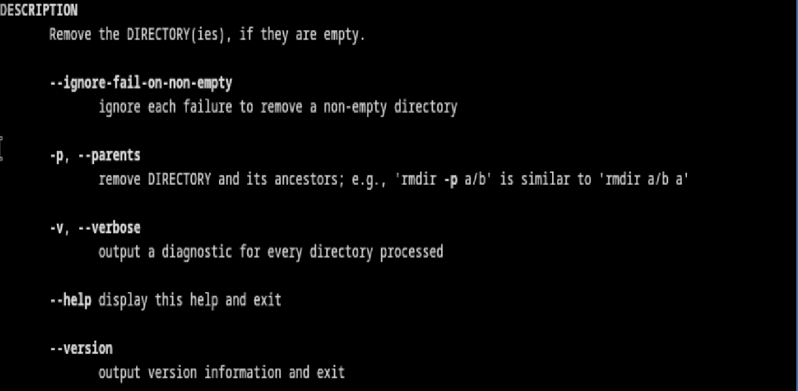
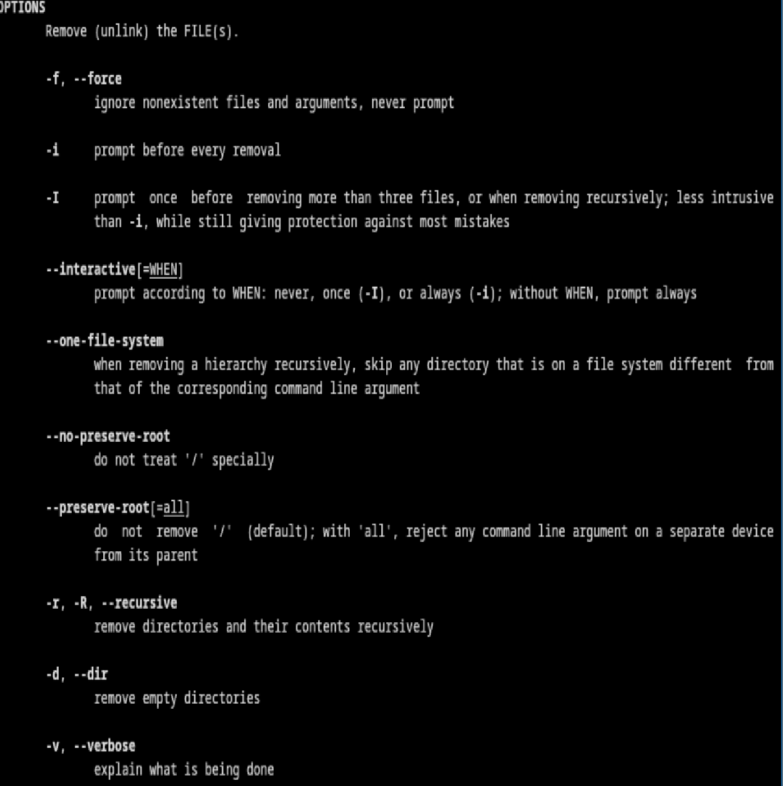

---
## Author
author:
  name: Хасанов Марат Наилович 
  degrees: DSc
  orcid: 0000-0002-0877-7063
  email: 132250428@rudn.ru
  affiliation:
    - name: Российский университет дружбы народов
      country: Российская Федерация
      postal-code: 117198
      city: Москва
      address: ул. Миклухо-Маклая, д. 6

## Title
title: "Лабораторная работа 6"

license: "CC BY"
---

# Информация

## Докладчик

:::::::::::::: {.columns align=center}
::: {.column width="70%"}

  * Хасанов Марат Наилович 
  * Студент НКА-07-25
  * Российский университет дружбы народов им. П. Лумумбы
  * [1132250428@rudn.ru](mailto:1132250428@rudn.ru)
  * <https://github.com/doter2007/study_2025-2026_os-intro>

:::
::: {.column width="30%"}

:::
::::::::::::::

#  Цель работы

Приобретение практических навыков взаимодействия пользователя с системой посредством командной строки.

# Выполнение лабораторной работы

## Определяю полное имя  домашнего каталога

## Перехожу в каталог /tmp и вывожу на экран вывод команды ls с различными опциями

## Перехожу в каталог /var/spool и с помощью команды ls определяю наличие подкаталога cron 

## Перехожу в домашний каталог и вывожу на экран его содержимое. Видно, что владельцом файлов и подкаталогов  является пользователь kmarat и root

{#fig-004 width=70%}

## В домашнем каталоге создаю каталог newdir, внутри которого создаю каталог morefun, создаю в нем три каталога одной командой и удаляю одной командой

## Удаляю каталог newdir

## С помощью команды man определил, какую опцию команды ls нужно использовать для просмотра содержимое не только указанного каталога, но и подкаталогов,входящих в него. Применяю команду ls -R

## С помощью команды man определяю набор опций команды ls, позволяющий отсортировать по времени последнего изменения выводимый список содержимого каталога с развёрнутым описанием файлов.Применяю команду ls -lt

## Использую команду man для просмотра описания следующих команд: pwd

## Использую команду man для просмотра описания следующих команд: cd

## Использую команду man для просмотра описания следующих команд: mkdir

## Использую команду man для просмотра описания следующих команд: rmdir

## Использую команду man для просмотра описания следующих команд: rm

## Используя информацию, полученную при помощи команды history, выполняю модификацию и исполнение нескольких команд из буфера команд.

## Выводы
Мы приобрели практические навыки взаимодействия пользователя с системой посредством командной строки.

:::
