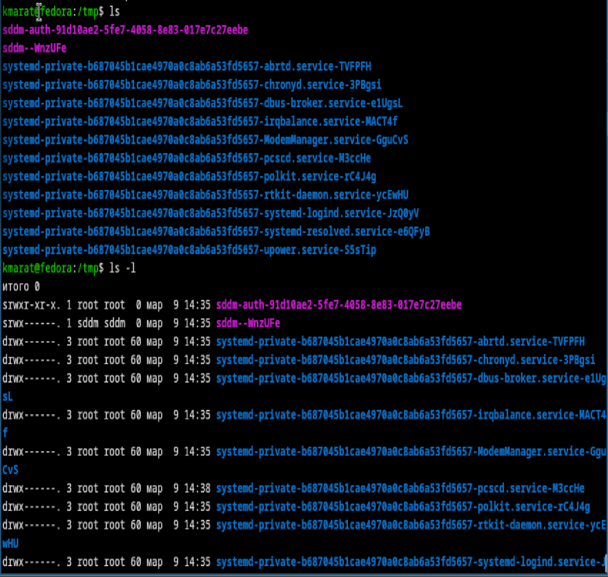
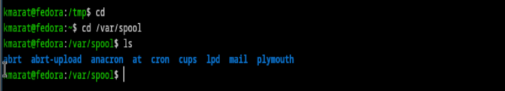
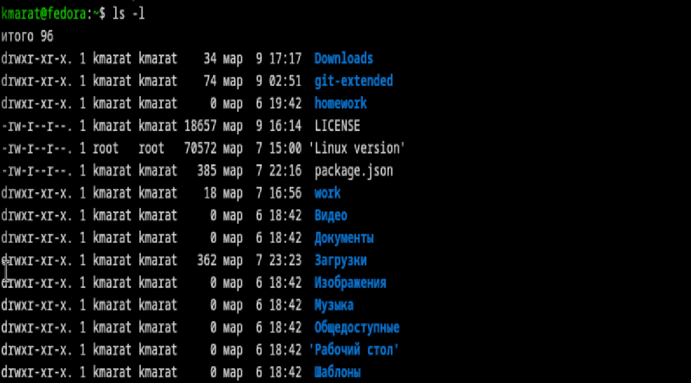
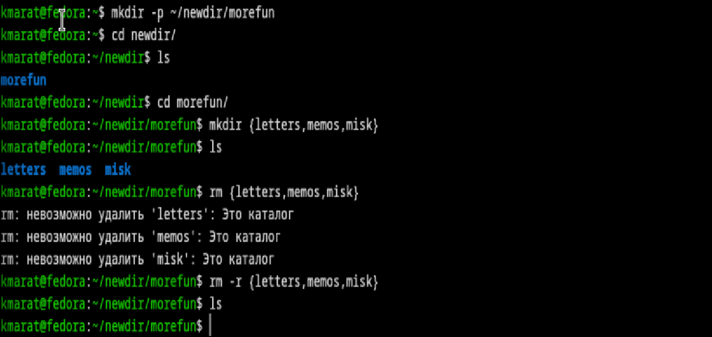
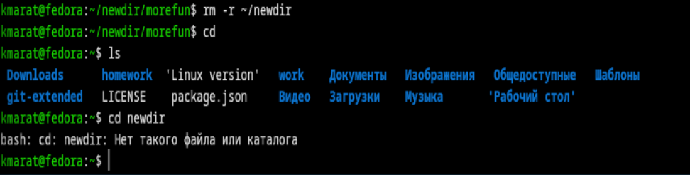
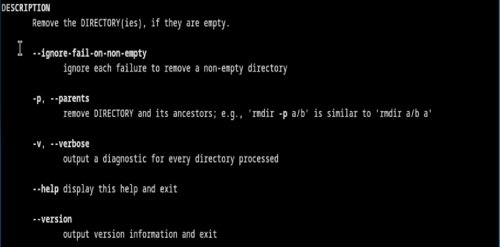
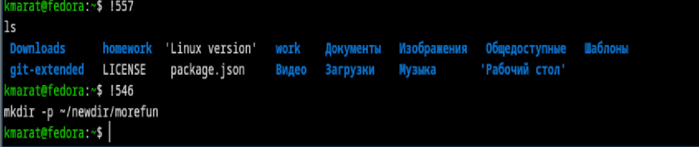

---
## Author
author:
  name: Хасанов Марат Наилович 
  degrees: DSc
  orcid: 0000-0002-0877-7063
  email: 132250428@rudn.ru
  affiliation:
    - name: Российский университет дружбы народов
      country: Российская Федерация
      postal-code: 117198
      city: Москва
      address: ул. Миклухо-Маклая, д. 6

## Title
title: "Лабораторная работа 6"

license: "CC BY"
---

# Цель работы
Приобретение практических навыков взаимодействия пользователя с системой посредством командной строки.

# Выполнение лабораторной работы

Определяю полное имя  домашнего каталога([рис. @fig-001]).

{#fig-001 width=70%}

Перехожу в каталог /tmp и вывожу на экран вывод команды ls с различными опциями([рис. @fig-002]).

{#fig-002 width=70%}

Перехожу в каталог /var/spool и с помощью команды ls определяю наличие подкаталога cron ([рис. @fig-003]).

{#fig-003 width=70%}

Перехожу в домашний каталог и вывожу на экран его содержимое. Видно, что владельцом файлов и подкаталогов  является пользователь kmarat и root([рис. @fig-004]).

{#fig-004 width=70%}

В домашнем каталоге создаю каталог newdir, внутри которого создаю каталог morefun, создаю в нем три каталога одной командой и удаляю одной командой([рис. @fig-005]).

{#fig-005 width=70%}

Удаляю каталог newdir([рис. @fig-006]).

{#fig-006 width=70%}

С помощью команды man определил, какую опцию команды ls нужно использовать для просмотра содержимое не только указанного каталога, но и подкаталогов,входящих в него. Применяю команду ls -R([рис. @fig-007]).

{#fig-007 width=70%}

С помощью команды man определяю набор опций команды ls, позволяющий отсортировать по времени последнего изменения выводимый список содержимого каталога с развёрнутым описанием файлов.Применяю команду ls -lt([рис. @fig-008]).

{#fig-008 width=70%}

Использую команду man для просмотра описания следующих команд: pwd([рис. @fig-009]).

{#fig-009 width=70%}

Использую команду man для просмотра описания следующих команд: cd([рис. @fig-010]).

{#fig-010 width=70%}

Использую команду man для просмотра описания следующих команд: mkdir([рис. @fig-011]).

{#fig-011 width=70%}

Использую команду man для просмотра описания следующих команд: rmdir([рис. @fig-012]).

{#fig-012 width=70%}

Использую команду man для просмотра описания следующих команд: rm([рис. @fig-013]).

{#fig-013 width=70%}

Используя информацию, полученную при помощи команды history, выполняю модификацию и исполнение нескольких команд из буфера команд.([рис. @fig-014]).

{#fig-014 width=70%}

# Выводы

В результате выполнения данной лабораторной работы я приобрел необходимые навыки работы с гит, научился созданию репозиториев, gpg и ssh ключей, настроил каталог курса и авторизовался в gh.

# Список литературы{.unnumbered}

::: {#refs}
:::
