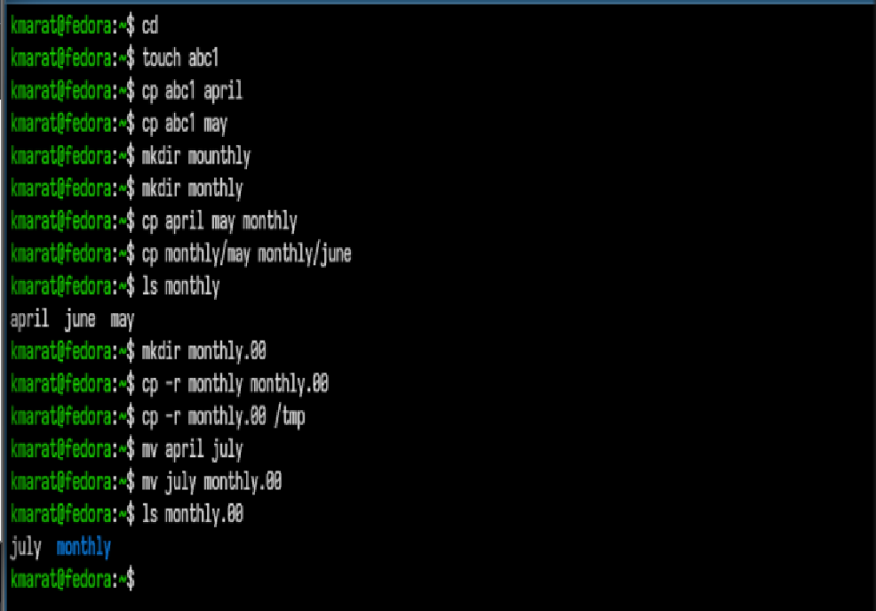
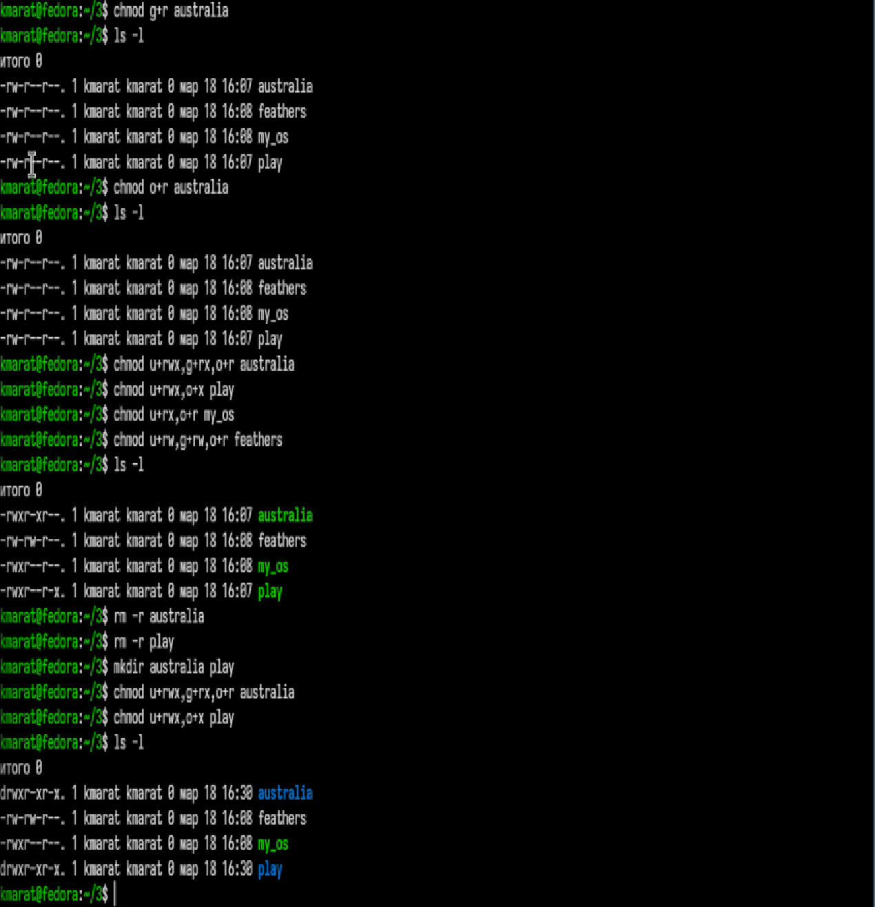
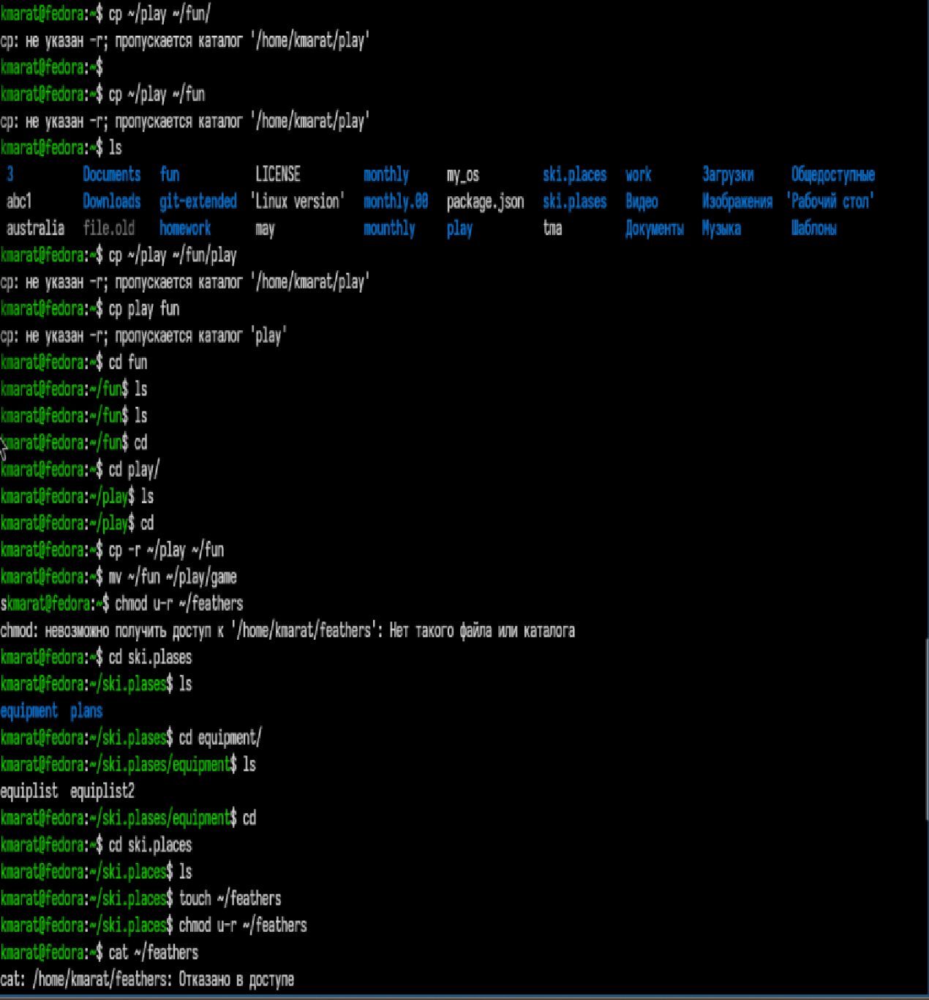

---
## Author
author:
  name: Хасанов Марат Наилович 
  degrees: DSc
  orcid: 0000-0002-0877-7063
  email: 132250428@rudn.ru
  affiliation:
    - name: Российский университет дружбы народов
      country: Российская Федерация
      postal-code: 117198
      city: Москва
      address: ул. Миклухо-Маклая, д. 6

## Title
title: "Лабораторная работа 7"

license: "CC BY"
---

# Цель работы
Ознакомление с файловой системой Linux, её структурой, именами и содержанием каталогов. Приобретение практических навыков по применению команд для работы с файлами и каталогами, по управлению процессами (и работами), по проверке исполь- зования диска и обслуживанию файловой системы.

# Задания

1. Выполните все примеры, приведённые в первой части описания лабораторной работы.
2. Выполните следующие действия, зафиксировав в отчёте по лабораторной работе используемые при этом команды и результаты их выполнения: 2.1. Скопируйте файл /usr/include/sys/io.h в домашний каталог и назовите его equipment. Если файла io.h нет, то используйте любой другой файл в каталоге /usr/include/sys/ вместо него. 2.2. В домашнем каталоге создайте директорию ~/ski.plases. 2.3. Переместите файл equipment в каталог ~/ski.plases. 2.4. Переименуйте файл ~/ski.plases/equipment в ~/ski.plases/equiplist. 2.5. Создайте в домашнем каталоге файл abc1 и скопируйте его в каталог ~/ski.plases, назовите его equiplist2. 2.6. Создайте каталог с именем equipment в каталоге ~/ski.plases. 2.7. Переместите файлы ~/ski.plases/equiplist и equiplist2 в каталог ~/ski.plases/equipment. 2.8. Создайте и переместите каталог ~/newdir в каталог ~/ski.plases и назовите его plans.
3. Определите опции команды chmod, необходимые для того, чтобы присвоить перечис- ленным ниже файлам выделенные права доступа, считая, что в начале таких прав нет: 3.1. drwxr--r-- ... australia 3.2. drwx--x--x ... play 3.3. -r-xr--r-- ... my_os 3.4. -rw-rw-r-- ... feathers При необходимости создайте нужные файлы.
4. Проделайте приведённые ниже упражнения, записывая в отчёт по лабораторной работе используемые при этом команды: 4.1. Просмотрите содержимое файла /etc/password. 4.2. Скопируйте файл ~/feathers в файл ~/file.old. 4.3. Переместите файл ~/file.old в каталог ~/play. 4.4. Скопируйте каталог ~/play в каталог ~/fun. 4.5. Переместите каталог ~/fun в каталог ~/play и назовите его games. 4.6. Лишите владельца файла ~/feathers права на чтение. 4.7. Что произойдёт, если вы попытаетесь просмотреть файл ~/feathers командой cat? 4.8. Что произойдёт, если вы попытаетесь скопировать файл ~/feathers? 4.9. Дайте владельцу файла ~/feathers право на чтение. 4.10. Лишите владельца каталога ~/play права на выполнение. 4.11. Перейдите в каталог ~/play. Что произошло? 4.12. Дайте владельцу каталога ~/play право на выполнение.
5. Прочитайте man по командам mount, fsck, mkfs, kill и кратко их охарактеризуйте, приведя примеры.

# Выполнение лабораторной работы

Выполняю все примеры, приведённые в первой части описания лабораторной работы.([рис. @fig-001]).

{#fig-001 width=70%}

Выполняю примеры присвоения прав к файлам.([рис. @fig-002]).

{#fig-002 width=70%}

Выполняю второе задание ([рис. @fig-003]).

{#fig-003 width=70%}

Выполняю третье задание([рис. @fig-004]).

{#fig-004 width=70%}

Выполняю четвертое задание([рис. @fig-005]).

{#fig-005 width=70%}

Просматриваю опции команд с помощью man([рис. @fig-006]).

{#fig-006 width=70%}

# Выводы

Мы ознакомились с файловой системой Linux, её структурой, именами и содержанием каталогов. Приобрели практические навыки по применению команд для работы с файлами и каталогами, по управлению процессами (и работами), по проверке исполь- зования диска и обслуживанию файловой системы.

# Список литературы{.unnumbered}

::: {#refs}
:::
