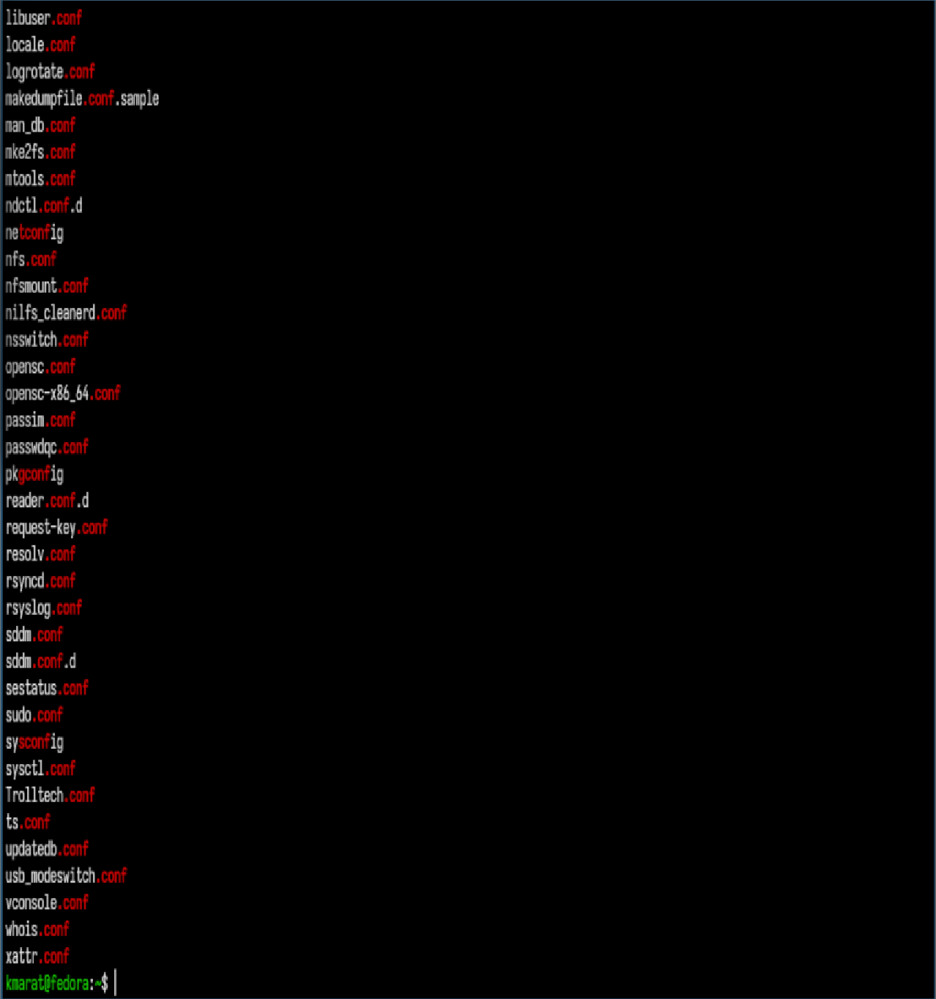
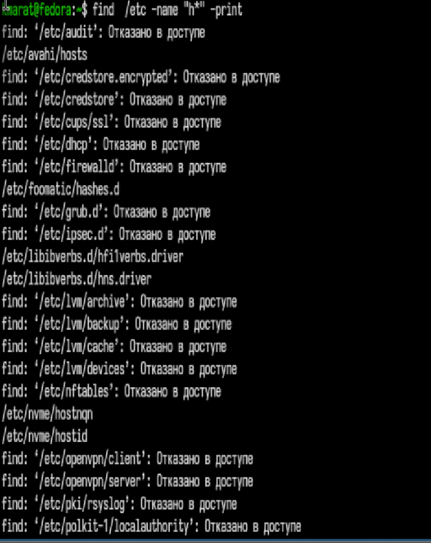
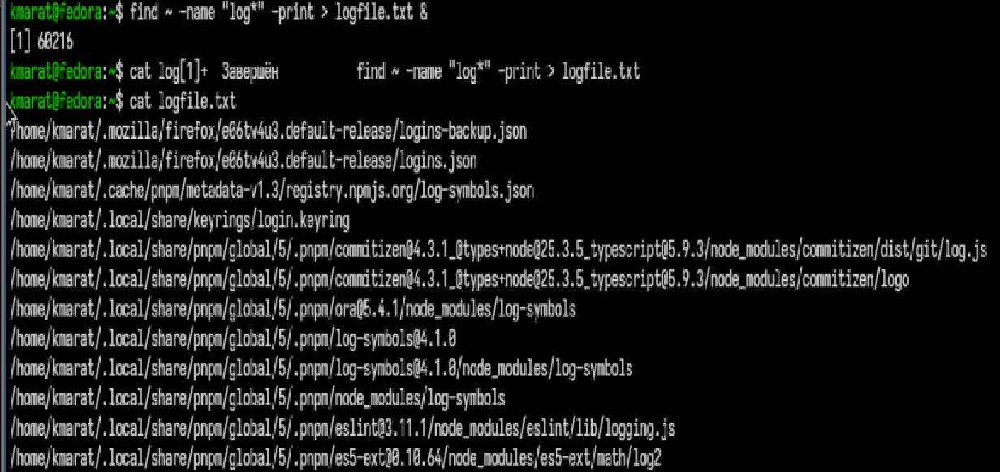
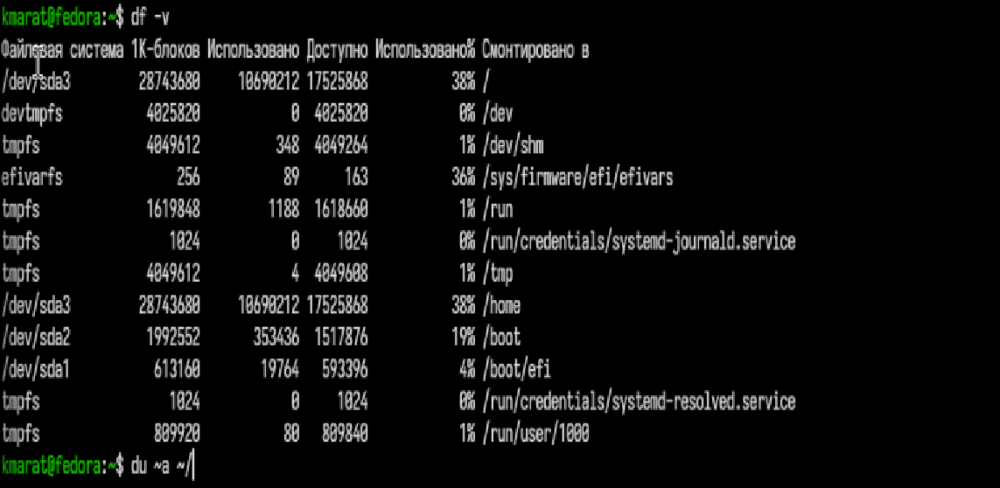
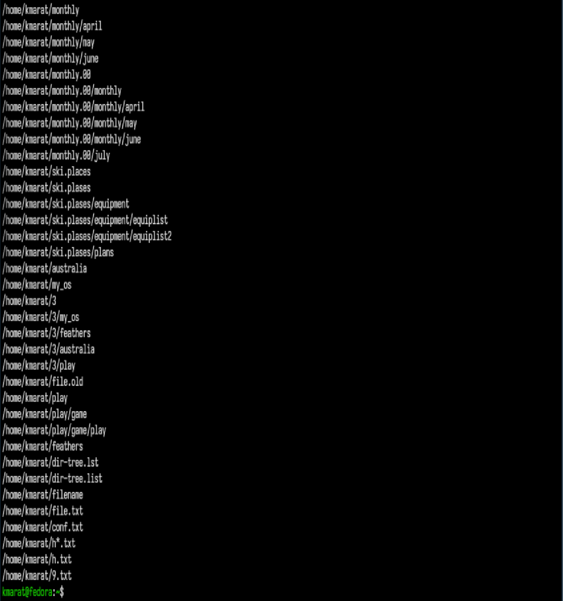

---
## Author
author:
  name: Хасанов Марат Наилович 
  degrees: DSc
  orcid: 0000-0002-0877-7063
  email: 132250428@rudn.ru
  affiliation:
    - name: Российский университет дружбы народов
      country: Российская Федерация
      postal-code: 117198
      city: Москва
      address: ул. Миклухо-Маклая, д. 6

## Title
title: "Лабораторная работа 8"

license: "CC BY"
---

# Информация

## Докладчик

:::::::::::::: {.columns align=center}
::: {.column width="70%"}

  * Хасанов Марат Наилович 
  * Студент НКА-07-25
  * Российский университет дружбы народов им. П. Лумумбы
  * [1132250428@rudn.ru](mailto:1132250428@rudn.ru)
  * <https://github.com/doter2007/study_2025-2026_os-intro>

:::
::: {.column width="30%"}

:::
::::::::::::::

# Цель работы
Ознакомление с инструментами поиска файлов и фильтрации текстовых данных. Приобретение практических навыков: по управлению процессами (и заданиями), по проверке использования диска и обслуживанию файловых систем.

# Выполнение лабораторной работы

##  Записываю в файл file.txt названия файлов, содержащихся в каталоге /etc и в домашнем

## Вывожу имена всех файлов из file.txt, имеющих расширение .conf, после чего записываю их в новый текстовой файл conf.txt.

## Один из вариантов вывода файлов начинающиеся с буквы "с"

## Вывожу на экран (по странично) имена файлов из каталога /etc, начинающиеся
с символа h.

{#fig-004 width=70%}

##  Запускаю в фоновом режиме процесс, который будет записывать в файл ~/logfile файлы, имена которых начинаются с log.

##  Выполняю команды df и du, предварительно получив более подробную информацию об этих командах, с помощью команды man.

##  Воспользовавшись справкой команды find, вывожу имена всех директорий, имеющихся в вашем домашнем каталоге.

## Выводы

Мы ознакомились с инструментами поиска файлов и фильтрации текстовых данных. Приобрели практических навыков: по управлению процессами (и заданиями), по проверке использования диска и обслуживанию файловых систем.

:::
