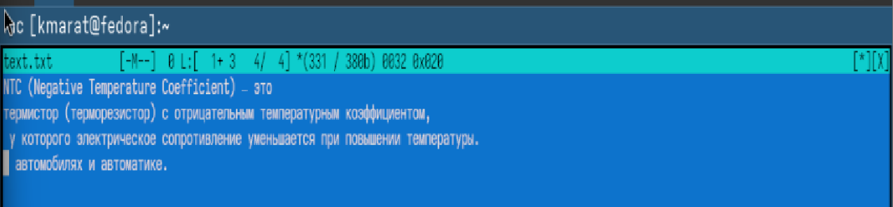
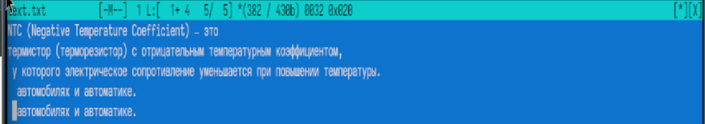
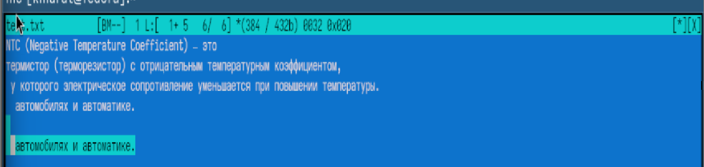
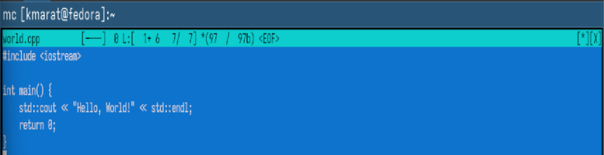

---
## Author
author:
  name: Хасанов Марат Наилович 
  degrees: DSc
  orcid: 0000-0002-0877-7063
  email: 132250428@rudn.ru
  affiliation:
    - name: Российский университет дружбы народов
      country: Российская Федерация
      postal-code: 117198
      city: Москва
      address: ул. Миклухо-Маклая, д. 6

## Title
title: "Лабораторная работа 9"

license: "CC BY"
---

# Информация

## Докладчик

:::::::::::::: {.columns align=center}
::: {.column width="70%"}

  * Хасанов Марат Наилович 
  * Студент НКА-07-25
  * Российский университет дружбы народов им. П. Лумумбы
  * [1132250428@rudn.ru](mailto:1132250428@rudn.ru)
  * <https://github.com/doter2007/study_2025-2026_os-intro>

:::
::: {.column width="30%"}

:::
::::::::::::::

# Цель работы
Освоение основных возможностей командной оболочки Midnight Commander. Приоб- ретение навыков практической работы по просмотру каталогов и файлов; манипуляций с ними.

# Выполнение лабораторной работы

## Создаютекстовой файл text.txt

## Удаляю строку текста.

## Выделяю фрагмент текста и скопировал его на новую строку.

## Выделяю фрагмент текста и перенесите его на новую строку
{#fig-004 width=70%}

## Отменяю последнее действие.

## Сохраняю и закрываю файл

## Открол файл с исходным текстом на некотором языке программирования (например C или Java)

## Выключаю подсветку

## Выводы

Мы освоили основные возможности командной оболочки Midnight Commander. Приоб- рели навыки практической работы по просмотру каталогов и файлов; манипуляций с ними.

:::
