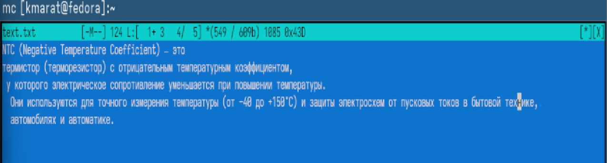
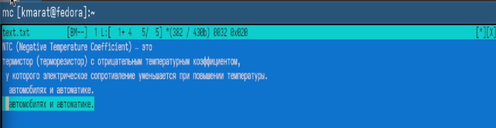
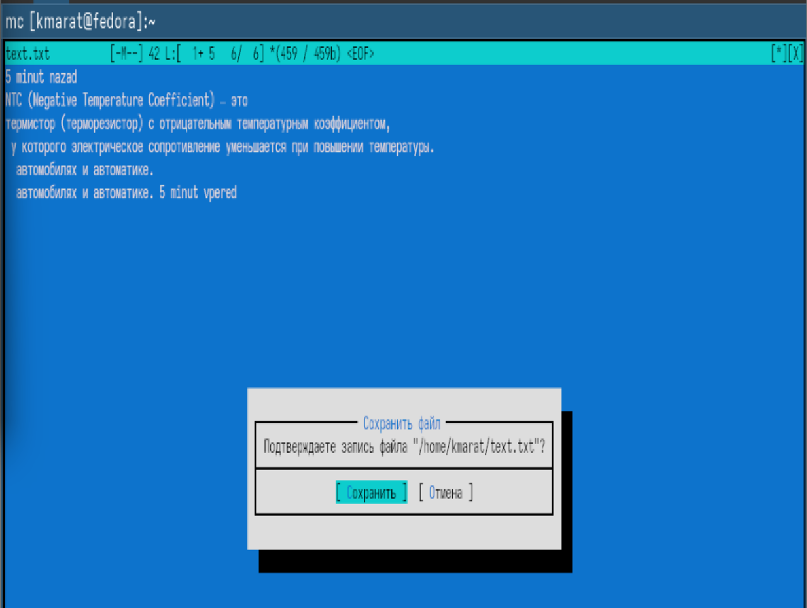
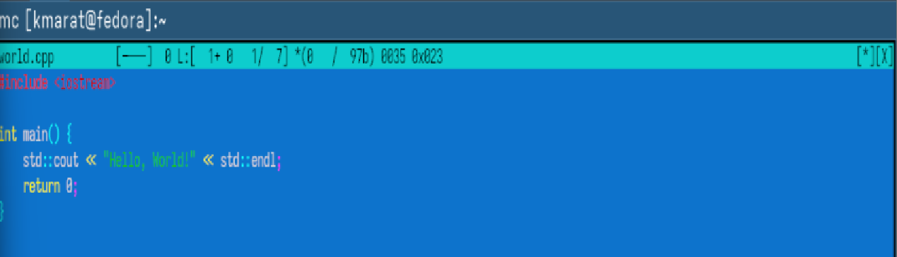

---
## Author
author:
  name: Хасанов Марат Наилович 
  degrees: DSc
  orcid: 0000-0002-0877-7063
  email: 132250428@rudn.ru
  affiliation:
    - name: Российский университет дружбы народов
      country: Российская Федерация
      postal-code: 117198
      city: Москва
      address: ул. Миклухо-Маклая, д. 6

## Title
title: "Лабораторная работа 9"

license: "CC BY"
---

# Цель работы
Освоение основных возможностей командной оболочки Midnight Commander. Приоб- ретение навыков практической работы по просмотру каталогов и файлов; манипуляций с ними.

# Задания 
1. Создайте текстовой файл text.txt.
2. Откройте этот файл с помощью встроенного в mc редактора.
3. Вставьте в открытый файл небольшой фрагмент текста, скопированный из любого
другого файла или Интернета.
4. Проделайте с текстом следующие манипуляции, используя горячие клавиши:
  4.1. Удалите строку текста.
  4.2. Выделите фрагмент текста и скопируйте его на новую строку
  4.3. Выделите фрагмент текста и перенесите его на новую строку.
  4.4. Сохраните файл.
  4.5. Отмените последнее действие.
  4.6. Перейдите в конец файла (нажав комбинацию клавиш) и напишите некоторый
        текст.
  4.7. Перейдите в начало файла (нажав комбинацию клавиш) и напишите некоторый
текст.
  4.8. Сохраните и закройте файл.
5. Откройте файл с исходным текстом на некотором языке программирования (например C или Java)
6. Используя меню редактора, включите подсветку синтаксиса, если она не включена,
или выключите, если она включена.

# Выполнение лабораторной работы

Создаютекстовой файл text.txt([рис. @fig-001]).

{#fig-001 width=70%}

Удаляю строку текста.([рис. @fig-002]).

{#fig-002 width=70%}

Выделяю фрагмент текста и скопировал его на новую строку. ([рис. @fig-003]).

{#fig-003 width=70%}

Выделяю фрагмент текста и перенесите его на новую строку([рис. @fig-004]).

{#fig-004 width=70%}

Отменяю последнее действие.([рис. @fig-005]).

{#fig-005 width=70%}

Сохраняю и закрываю файл([рис. @fig-006]).

{#fig-006 width=70%}

Открол файл с исходным текстом на некотором языке программирования (например C или Java)([рис. @fig-007]).

{#fig-007 width=70%}

Выключаю подсветку([рис. @fig-008]).

{#fig-008 width=70%}

# Выводы

Мы освоили основные возможности командной оболочки Midnight Commander. Приоб- рели навыки практической работы по просмотру каталогов и файлов; манипуляций с ними.

# Список литературы{.unnumbered}

::: {#refs}
:::
