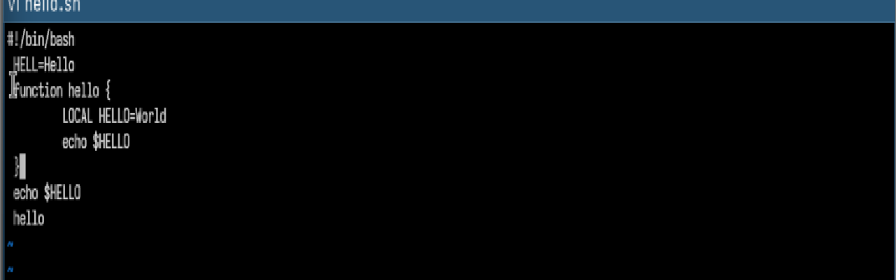
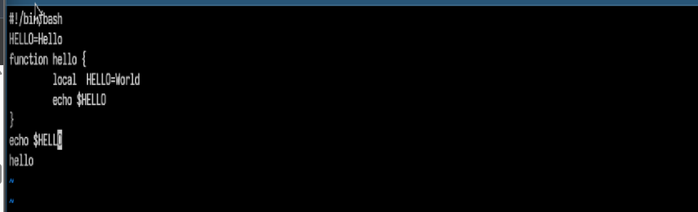

---
## Author
author:
  name: Хасанов Марат Наилович 
  degrees: DSc
  orcid: 0000-0002-0877-7063
  email: 132250428@rudn.ru
  affiliation:
    - name: Российский университет дружбы народов
      country: Российская Федерация
      postal-code: 117198
      city: Москва
      address: ул. Миклухо-Маклая, д. 6

## Title
title: "Лабораторная работа 10"

license: "CC BY"
---

# Цель работы
Ознакомление с инструментами поиска файлов и фильтрации текстовых данных. Приобретение практических навыков: по управлению процессами (и заданиями), по проверке использования диска и обслуживанию файловых систем.

# Задание

1. Создайте каталог с именем ~/work/os/lab06.
2. Перейдите во вновь созданный каталог.
3. Вызовите vi и создайте файл hello.sh
4. Нажмите клавишу i и вводите следующий текст.
5. Нажмите клавишу Esc для перехода в командный режим после завершения ввода
текста.
6. Нажмите : для перехода в режим последней строки и внизу вашего экрана появится
приглашение в виде двоеточия.
7. Нажмите w (записать) и q (выйти), а затем нажмите клавишу Enter для сохранения
вашего текста и завершения работы.
8. Сделайте файл исполняемым
9. Редактирование существующего файла
# Выполнение лабораторной работы

Выполняю задание([рис. @fig-001]).

{#fig-001 width=70%}

Делаю файл исполняемым([рис. @fig-002]).

{#fig-002 width=70%}

Редактирую файл([рис. @fig-003]).

{#fig-003 width=70%}

# Выводы

Мы Познакомились с операционной системой Linux. Получили практические навыки рабо- ты с редактором vi, установленным по умолчанию практически во всех дистрибутивах.
# Список литературы{.unnumbered}

::: {#refs}
:::
