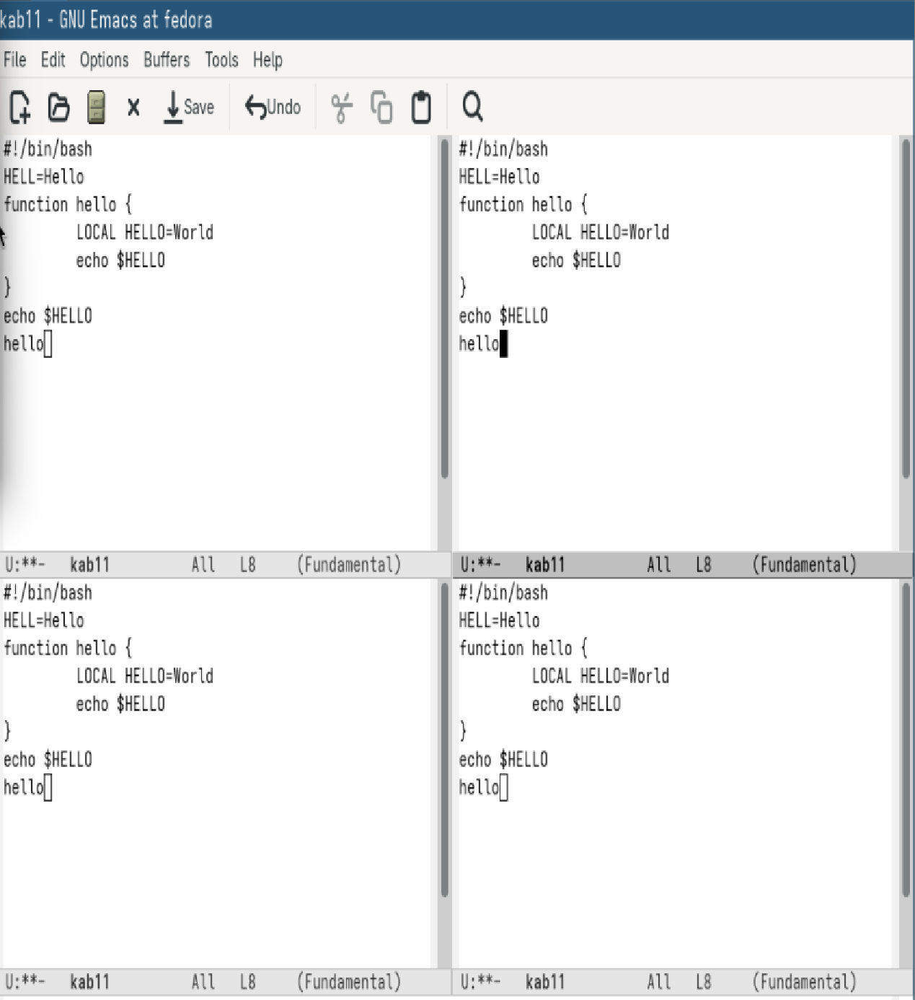
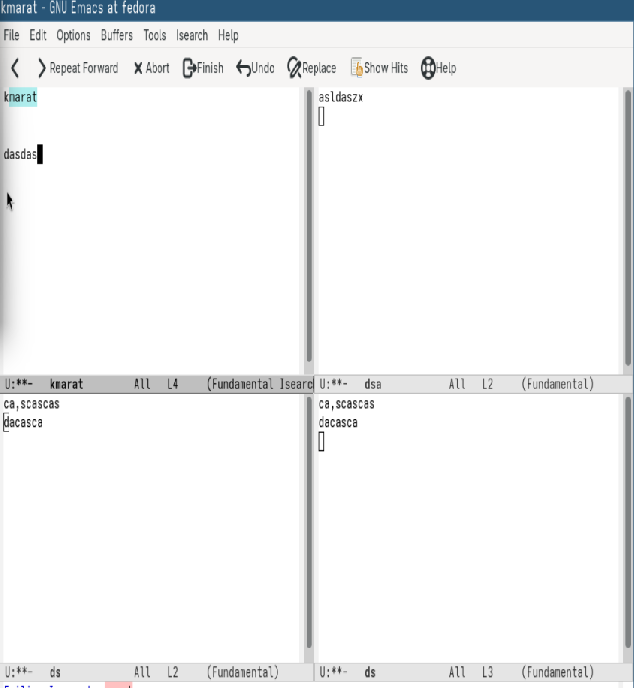

---
## Author
author:
  name: Хасанов Марат Наилович 
  degrees: DSc
  orcid: 0000-0002-0877-7063
  email: 132250428@rudn.ru
  affiliation:
    - name: Российский университет дружбы народов
      country: Российская Федерация
      postal-code: 117198
      city: Москва
      address: ул. Миклухо-Маклая, д. 6

## Title
title: "Лабораторная работа 11"

license: "CC BY"
---

# Цель работы
Ознакомление с инструментами поиска файлов и фильтрации текстовых данных. Приобретение практических навыков: по управлению процессами (и заданиями), по проверке использования диска и обслуживанию файловых систем.

# Задание

1. Открыть emacs.
2. Создать файл lab07.sh с помощью комбинации Ctrl-x Ctrl-f (C-x C-f).
3. Наберите текст:
4. Сохранить файл с помощью комбинации Ctrl-x Ctrl-s (C-x C-s).
5. Проделать с текстом стандартные процедуры редактирования, каждое действие должно осуществляться комбинацией клавиш.
  5.1. Вырезать одной командой целую строку (С-k).
  5.2. Вставить эту строку в конец файла (C-y).
  5.3. Выделить область текста (C-space).
  5.4. Скопировать область в буфер обмена (M-w).
  5.5. Вставить область в конец файла.
  5.6. Вновь выделить эту область и на этот раз вырезать её (C-w).
  5.7. Отмените последнее действие (C-/).
6. Научитесь использовать команды по перемещению курсора.
  6.1. Переместите курсор в начало строки (C-a).
  6.2. Переместите курсор в конец строки (C-e).
  6.3. Переместите курсор в начало буфера (M-<).
  6.4. Переместите курсор в конец буфера (M->).
7. Управление буферами.
  7.1. Вывести список активных буферов на экран (C-x C-b).
  7.2. Переместитесь во вновь открытое окно (C-x) o со списком открытых буферов
и переключитесь на другой буфер.
  7.3. Закройте это окно (C-x 0).
  7.4. Теперь вновь переключайтесь между буферами, но уже без вывода их списка на
экран (C-x b).
8. Управление окнами.
  8.1. Поделите фрейм на 4 части: разделите фрейм на два окна по вертикали (C-x 3),
а затем каждое из этих окон на две части по горизонтали (C-x 2)

  8.2. В каждом из четырёх созданных окон откройте новый буфер (файл) и введите
несколько строк текста.
9. Режим поиска
  9.1. Переключитесь в режим поиска (C-s) и найдите несколько слов, присутствующих
в тексте.
  9.2. Переключайтесь между результатами поиска, нажимая C-s.
  9.3. Выйдите из режима поиска, нажав C-g.
  9.4. Перейдите в режим поиска и замены (M-%), введите текст, который следует найти
и заменить, нажмите Enter , затем введите текст для замены. После того как будут
подсвечены результаты поиска, нажмите ! для подтверждения замены.
  9.5. Испробуйте другой режим поиска, нажав M-s o. Объясните, чем он отличается от
обычного режима?

# Выполнение лабораторной работы

Отрываю emacs и набираю текст([рис. @fig-001]).

{#fig-001 width=70%}

Выполняю редактирование файла с помощью горячих клавиш([рис. @fig-002]).

{#fig-002 width=70%}

Открываю буфер обмена([рис. @fig-003]).

{#fig-003 width=70%}

Управляю окнами.([рис. @fig-004]).

{#fig-004 width=70%}

Открываю буфер во всех окнах([рис. @fig-005]).

{#fig-005 width=70%}

Выполняю задания в буфере([рис. @fig-006]).

{#fig-006 width=70%}

# Выводы

Мы Познакомились с операционной системой Linux. Получили практические навыки работы с редактором Emacs.

# Список литературы{.unnumbered}

::: {#refs}
:::
